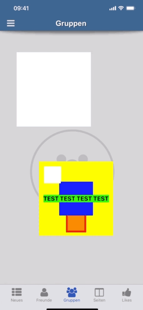

# Titanium resizable-view module 
## (iOS only at the moment)





## Methods

### MODULE  -> `createView({properties}) `
returns the **resizableViewObject**

## Properties

### `handleSize:Integer `

### `handleColor:Hex/String`

### `handleEnabled:Bool`
if the edit handles are enabled at start or not

### `minimumHeight:Integer`

### `minimumWidth:Integer`

### `contentView:Ti.UI.VIEW`


## Events
### `selected -> returns nothing`

### `unselected -> returns nothing`


## Example

```
	  var resizableContentView = Ti.UI.createView({
		width:Ti.UI.SIZE,
		height:Ti.UI.SIZE,
		backgroundColor:'yellow'
	  });

	  var resizableContentViewLabel = Titanium.UI.createLabel({
		text:'TEST TEST TEST TEST',
		backgroundColor:'green',
		font:{fontSize:18,fontWeight:'bold'},
		color:'black',
		ellipsize: true,
		width:Ti.UI.SIZE,
		height:Ti.UI.SIZE
	 });


	 var resizableContentViewChild = Ti.UI.createView({
		width:100,
		height:100,
		backgroundColor:'blue'
	 });

	 resizableContentView.add(resizableContentViewChild);
	 resizableContentView.add(resizableContentViewLabel);

	 var resizableView = resizableviewModule.createView({
	  	top:100,
		width:250,
		height:250,
		handleSize:20,
		handleColor:'blue',
		//handleEnabled:false,
		minimumHeight:150,
		minimumWidth:150,
		contentView:resizableContentView,
		backgroundColor:'transparent'
	 });


	 resizableView.addEventListener("selected",function(){
	 	console.log("+++++++++ resizableView selected");
	 });

         resizableView.addEventListener("unselected",function(){
	 	console.log("+++++++++ resizableView unselected");
	 });

	 YOUR_PARENT_VIEW.add(resizableView);

```js

## License

MIT

## Author

Marc Bender

original code from https://github.com/irons163/IRUserResizableView
